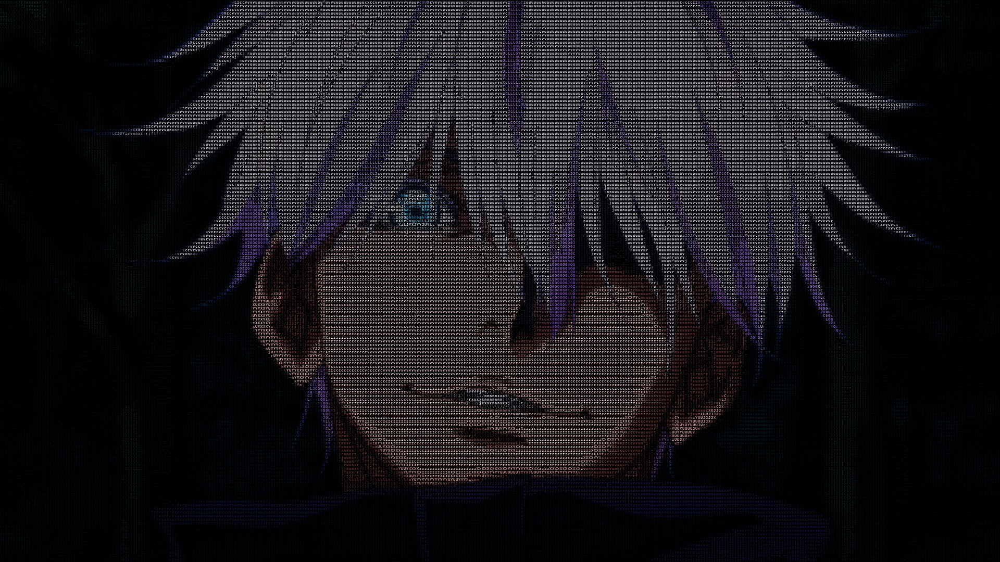
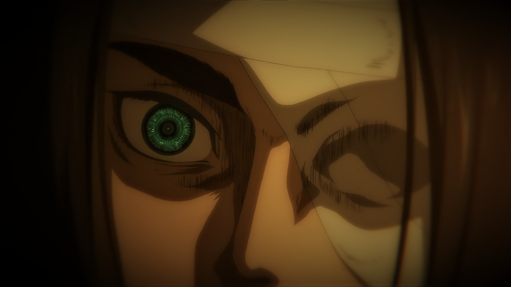
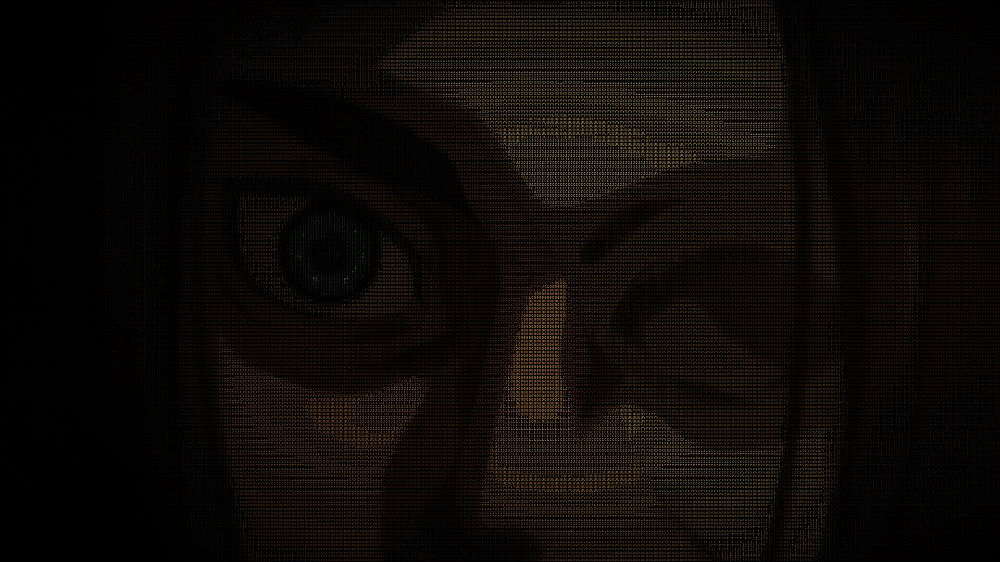

# ASCIIfying a Webcam Live Feed
## Table of Contents
* Description
* How to Run the Project
* Demo / Results
* Internal Workings
* Knowledge Gained
* References

## Description
 This Project is aimed at displaying a live feed from a Webcam into its ASCII Art form. 

## How to Run the Project
 I have developed this project in [_Python_](https://www.python.org/). So we'll firstly be requiring Python to be installed on the System.

 The following dependencies from Python have been used:
1. **Numpy** - for array manipulations
2. **OpenCV** - for working in different color spaces and capturing webcam feed
3. **Pillow** - used for drawing the ASCII art 

### Instructions
1. First, install all the required dependencies on your local system using the `pip install` command.
    * `pip install numpy`
    * `pip install opencv-python`
    * `pip install Pillow`
    
    You can ignore this step if the mentioned dependencies are already installed.
2. Clone this repo by using the following command:

```
 git clone https://github.com/d33pr0ckz/Live-ASCII-Webcam.git
 ```

3. Open a terminal in the root directory of this repository.
4. The python script can accept atmost 4 arguments which have been mentioned below along with their identifiers:
    * **ColorType** - "color" for colored feed, or "b&w" for Black & White. Default is "b&w".
    
        `"-c", "--colortype"`
    * **FontSize** - Size of the Font of the ASCII characters to be used in ASCII art. Always in integer. Default size is 10.
    
        `"-f", "--fontsize"`
    * **Gamma** - Value for Gamma correction, used for adjusting brightness of the video. Gamma > 1 makes feed brighter and Gamma < 1 makes feed darker. Default value is 1.0.
    
        `"-g", "--gamma"`
    * **CamNumber** - If you have multiple webcams connected to your system, each will be alloted a number starting from 0 for the default webcam. 
    
        `"-C", "--cam"`
    
5. Enter the following command in the terminal with the optional arguments you want to use.
```
    python CamASCIIfy.py -c <color> -f <font size> -g <gamma> -C <camera number>
```

6. A new window with the title **ASCII Live Feed** will show up.
7. Enter `Space` to exit the program.
    
## Demo / Results


https://user-images.githubusercontent.com/65613807/174869133-7bb07792-e390-4485-8f0a-907b36cffdb4.mp4


https://user-images.githubusercontent.com/65613807/174869163-c3eceb5e-e721-4c94-b479-8f60462284db.mp4


## Internal Workings
 The webcam is just another camera that captures a video through its lens and shows it on the screen. So, in other terms, our goal is to ASCIIfy the video captured through the webcam, but in *real* time. 

 What is a video made up of? At its core, its just a collection of continuous images which are displayed in order when played. These continuous images are called *Frames*.

 Our goal finally, is to ASCIIfy each of these frames individually and display them. 

### Step 1: ASCIIfy a frame
 Breakdown of an Image - It is made up of smaller components called **Pixels**. Often we use the phrase "This image has a resolution of 1920x1080". This means the image has a *Width* of 1920 and *Height* of 1080 pixels. Therefore the total number of pixels:
 
 1920 x 1080 = 2,073,600 pixels.

 These images have another attribute known as *Channel*. This Channel contains information regarding color of the image. Since there are different types of Color spaces, the number of channels also change according to their color space. 
 
 A Greyscale image has only 1 channel(0 - 255) where 0 represents Black and 255 represents White. As the number increases from 0 to 255, the shade of black becomes lighter till it finally becomes full white. Similiarly an image in the RGB color space, has 3 different channels(Red, Blue and Green). And the composition of all these channels together gives the final image.

 In computers, Images are thus stored as Data in a 3D Matrix having the form `Width * Height * Channel`.

 The intensity of each pixel can be found from the information of its channel. A greyscale image has only one channel and thus the intensity of its pixel is provided by that channel itself, whereas in a RGB image, it has 3 channels, and the average of values of these 3 channels `(r + b + g)/3` provides the intensity of the pixel. 

 For the ASCII art, we use a Character Map. It is an set of characters that are sorted according the amount of whitespace they occupy in a particular area. The Character Map used in this project:

 ```
  .'`^\",:;Il!i><~+_-?][}{1)(|\/tfjrxnuvczXYUJCLQ0OZmwqpdbkhao*#MW&8%B@$
 ```

 Notice here how a period(.) occupies less whitespace than compared to that of Hash(#). We can see that this Character Map is in ascending order. Here is where we use the value of Intensity. The Range of Intensity is 0 - 255. To find a character which corresponds to the Intensity, we use the following line of code:
 ```
 position = int((intensity / 255) * (len(charMap) - 1))
 ```
 *position* stores the index of the character to be used for that value of Intensity.

 We can also add color to this ASCII character.
 Coming to the font used for this art, I've used Monospaced font. This is because monospaced fonts have a fixed height and width across all its characters and thus it becomes more meaningful to calculate the avg intensity and color over a particular grid.

 Algorithm for ASCIIfying a frame:

 1. Break the frame into a grid with
        
        Number of columns - frame_width/font_width
        Number of rows    - frame_height/font_height
 2. Iterate over each cell of the grid and calculate average intensity and color as mentioned above. 
 3. Find the character corresponding to the calculated Intensity and then fill the cell with that character and the calculated color.
 4. We've got ourselves an ASCIIfied frame!

 We create this grid using Pillow which is used to draw the monospace fonts on a blank grid. OpenCV can't do this, which is why Pillow is used in this case. OpenCV does all the image reading and processing stuff.

 Examples:

 Original Image
 

 ASCIIfied Image
 

 Original Image
 

 ASCIIfied Image
 
 
### Step 2: Capturing Webcam Feed
 Now that we know how to ASCIIfy an image, lets move forward to ASCIIfying a whole Webcam live feed. For this first we need to capture the feed from the webcam. OpenCV helps us in this step, and the following snippet of code is the basic for capturing webcam feed.
 ```
 webcam = cv2.VideoCapture(camNumber)
 while True:
    ret, frame = webcam.read()
    cv2.imshow("frame", frame)
    if cv2.waitKey(1) == ord(' '):
        break

webcam.release()
cv2.destroyAllWindows()
 ```
 This code first creates an object **webcam** of class *VideoCapture*, in which the webcam live feed is sent. *camNumber* basically tells which camera should the object access. Default webcam in all systems has a camNumber of 0. The *read()* function of **webcam** object captures a frame from the live feed. *ret* recieves the return value from capturing the camera frame, which is either true or false.

 To stop the live feed, enter `Space`. After this, we release the memory which was occupied by the **webcam** object.
 
### Combining both the steps
Now that we've seen both the steps, we need to combine them. Its nothing much to do, just read the frame as usual, but instead of displaying the captured frame, pass this frame through the function that ASCIIfies the frame. After its ASCIIfied, display the frame, and continue until you exit the program. I;ve created two functions in my script, One for a Black and White feed(Greyscale) and the other one for a colored feed.

### Color Spaces
Like I've discussed in Step 1, there are various color spaces. Some of them are:

* Greyscale
* BGR (Blue, Green, Red)
* RGB (Red, Green, Blue)
* HSV (Hue, Saturation, Value)
* LAB (Light, a, b)

In Step 1, I mentioned that we can find average Intensity of RGB image by averaging the values of each channel i.e. `(r + b + g)/3`.

However, we can even use other color spaces for finding intensity. 

* HSV - `(saturation + value)/2`
* LAB - `Light`

I've used HSV color space to find the intensity, but working with any one of these is fine. I've added the code for LAB in comments in necessary places.

However, finding color isn't as simple as that of Intensity. Normal averaging of color channels(Hue in HSV, and a & b channels in LAB) won't do the work. Hence for finding color I've used the typical RGB color space.

### Lagging Frames
If you've seen the above demo video, or have even tried out the script yourself, you would have noticed the live feed suffers noticeable lag. This is due to the processing speed. Between capturing the frame and displaying the ASCIIfied frame, the whole algorithm of ASCIIfying the frame takes place. Combine this with Python's slow processing speeds, it take considerable amount of time to display one frame.

Passing through a large font size would make the process somewhat faster but then the clarity of the live feed would decrease. 

## Knowledge Gained
This was my first project in Python, so it was a pretty fun learning experience for me, working with images and stuff. Python is a more "friendly" language than that of C++, i.e. there's not much syntax to be maintained and the language in python is more like that of sentences. But compared to C++, Python is very slow.

I did get to learn a lot on the different color spaces that I've mentioned in this repo and their channels and how each of them affect the image in their own way. Working and experimenting with these color spaces was lot of fun and challenging. At times, I had ended up with a Full blue color feed, and at times the colors were inverted (RGB and BGR) where red objects were displayed blue, and vice versa.

Got to learn how to process images and capture video through OpenCV.

I also tried to make the python script user friendly by making it able to accept arguments. For accepting and parsing arguments I used the *getopt* module, that stores options and arguments in a tuple. I had seen this kind of argument passing when I used to work with linux, but now I know how its made possible.

## References
* [The Ultimate Handbook for OpenCV & Pillow](https://medium.com/analytics-vidhya/the-ultimate-handbook-for-opencv-pillow-72b7eff77cd7)
* [Using OpenCV, Pillow and Python 3 to convert images to ASCII](https://ivbhatt.medium.com/asciify-b3a0c70433fa)
* [Color spaces in OpenCV (C++ / Python)](https://learnopencv.com/color-spaces-in-opencv-cpp-python/)
* [OpenCV Cameras and VideoCapture Tutorial](https://www.youtube.com/watch?v=rKcwcARdg9M)
* [Greyscale and RGB color spaces](https://aishack.in/tutorials/color-spaces-1/)
* [Python getopt module](https://www.journaldev.com/17508/python-getopt)

